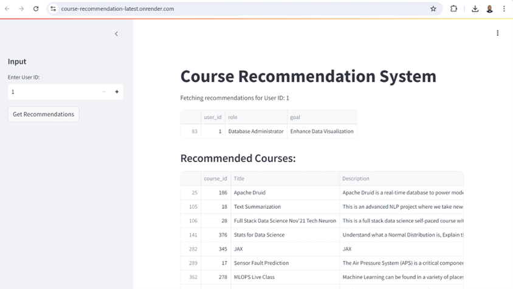

# Course Recommendation System


## Overview
The Course Recommendation System is designed to help learners discover relevant courses based on their previous interactions and the content of available courses. This project leverages a hybrid approach, combining collaborative filtering and content-based filtering, to generate personalized course recommendations.

## Features
- **Hybrid Recommendation Model**: Combines collaborative filtering (SVD) and content-based filtering (TF-IDF) for improved accuracy.
- **Streamlit Interface**: User-friendly interface allowing users to input their details and receive personalized course recommendations.
- **Dockerized Deployment**: The application is containerized using Docker for ease of deployment and scalability.
- **Hosted on Render**: The application is deployed on Render, ensuring reliability and performance.

## Deployed URL: 
https://course-recommendation-latest.onrender.com/

## Run locally

### Prerequisites 
- **Python 3.8+**
- **Docker**
- **Git**

### Clone the Repository
```bash
git clone https://github.com/yourusername/course-recommendation-system.git
cd course-recommendation-system
```

### create .env file and add environmental variable
```bash
MONGO_USERNAME = ""
MONGO_PASSWord = ""
```
### Run command
```bash
streamlit run app.py
```


